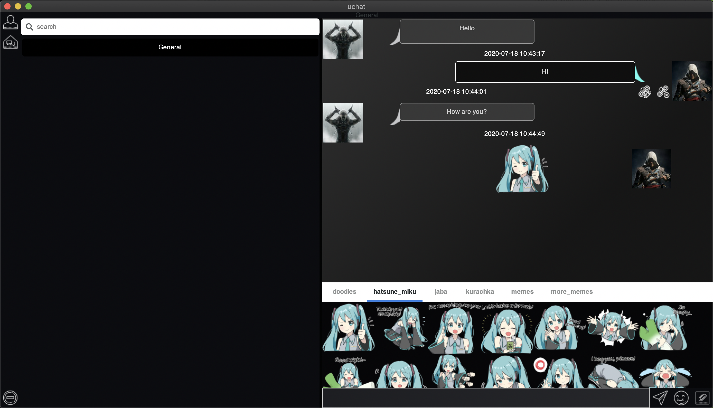
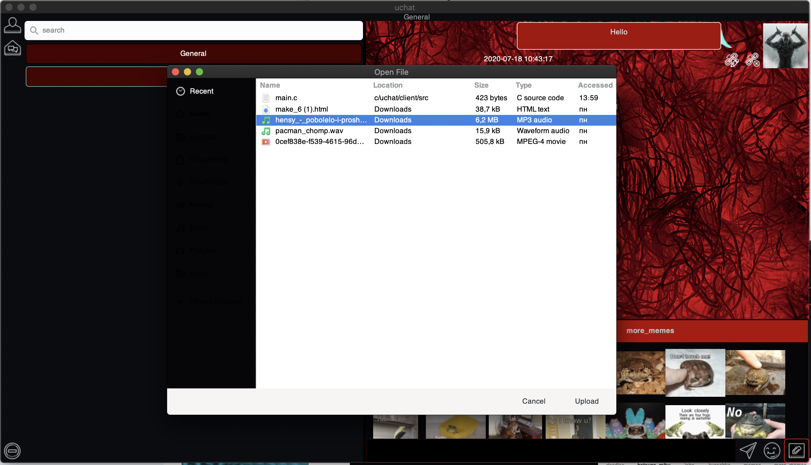

<head>
    <link rel = "stylesheet" href=".readme/styles/main.css">
</head>
<body>
    

    
uChat

    
Сreating messaging application for MacOS. Last challenge of C thread in uCode.

    
Apllication composed of two parts: client and server

    <h2><b>what we have implemented:</b></h2>
        <ul id="implement_list" type="disc">
            <li><a href="#a_gr_channel">Group channels</a></li>
            <li>Private messages</li>
            <li>Sticker packs</li>
            <li>File sending</li>
            <li>Builtin music player</li>
            <li>Themes</li>
            <li>Changing of profile image</li>
            <li>Different format of text (bold, italic, colored)</li>
            <li>Safe TLS connection</li>
            <li>Hashing of passwords</li>
            <li>Thread pool architecture on server side</li>
        </ul>
    

        <h2><b>Screenshots:</b></h2>
        <ol>
            <li>
        

            Group channel:
            
        

        </li>
        <li>
        

            Profile page:
            
        

        </li>
        <li>
        

            File sending:
            
        

        </li>
        </ol>
    

    

</body>